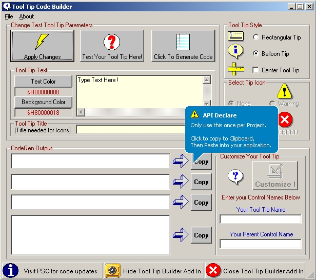



## Balloon Tool Tip Code Generator Add In

### Description

By Request, A VB6 Add In for creating Tool Tips.

Generates declares, DIM,s and code for Tool Tips.

Tool Tip can be standard rectangle, or Balloon style. Based on Easy Tool Tip Class on PSC

http://www.planet-source-code.com/vb/scripts/ShowCode.asp?lngWId=1&txtCodeId=57489

You can add the class module to your project, or ... use it as a "Real" Add In and go to the Project References (under "Project" on the tool menu)and check "Tool Tip Code Generator" to expose

the class to your project. Sample Project included. See the "ReadMe" file and clsToolTips module for details on use and properties of the class.
 
### More Info
 

             |
---                |---
**Submitted On**   |2004-12-16 07:32:14
**By**             |[Mark Mokoski](https://github.com/Planet-Source-Code/PSCIndex/blob/master/ByAuthor/mark-mokoski.md)
**Level**          |Intermediate
**User Rating**    |4.8 (100 globes from 21 users)
**Compatibility**  |VB 6\.0
**Category**       |[VB function enhancement](https://github.com/Planet-Source-Code/PSCIndex/blob/master/ByCategory/vb-function-enhancement__1-25.md)
**World**          |[Visual Basic](https://github.com/Planet-Source-Code/PSCIndex/blob/master/ByWorld/visual-basic.md)
**Archive File**   |[Tool\_Tip\_C18299112162004\.zip](https://github.com/Planet-Source-Code/mark-mokoski-balloon-tool-tip-code-generator-add-in__1-57698/archive/master.zip)

### API Declarations

See Code

